#Introducing the Team

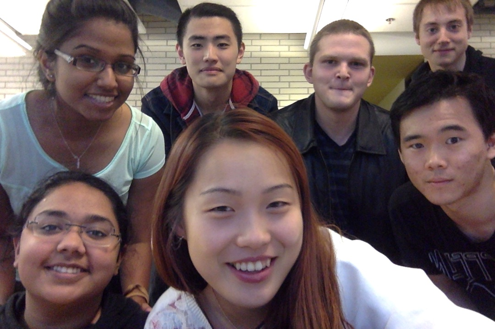

##Biographies

**Binuri Walpitagamage:**
I am a third year computer science student with a focus on Computer Systems and Web and Internet Technologies. I worked as an Agile software developer and tester at IBM Canada Software Labs from 2013 May to 2014 August and gained a strong background in Java and JUnit frameworks. 

**Tommy Li:**
	I am a third year student in the Computer Science specialist program. I have a strong 	
background in Python and Java, and I am particularly interested in Android development. I currently work part time as an Information Systems intern for the Faculty of Engineering Registrar’s Office, where I work in a LAMP stack environment. My hobbies include longboarding and rugby.
 
**Carl Gledhill:**
I am a fourth year student in my graduating year at U of T progressing towards a double major in Computer Science and Economics. I have lots of experience programming in a number of languages (Java, C, Python, Racket, SQL, VBA, HTML, CSS ect). This past summer I worked as a Statistical Analyst for York Region and automated many of their data completion methods using VBA saving them 1000’s of man hours. Currently I work part-time for a US-based company which specializes in testing hospital software. I also have a strong background in finance and economics; I am an avid stock trader and employ a variety of financial instruments, and strategies to maximise return while limiting systemic risk. In addition I am also a devout powerlifter and would like to break the drug-free Canadian deadlift record.

**Matt:**
I am a fourth year student in my last year at U of T in the computer science specialist program. This last summer I was part of UofT's accelerator program, The Hatchery, where I worked developing iOS and server side applications for enterprise instant messaging. I have a strong background in Go, Objective-C and Python. I've worked primarily with NoSQL databases like MongoDB and web frameworks such as Martini and Django. In previous years I've been involved with startups dealing dealing with instant messaging for mobile (Blackberry and iOS). 

**Amrutha:**
I am a third-year computer science specialist also doing a minor in English. I am interested in user interface design and graphic designing is a hobby of mine, I hope to pursue both simultaneously after I graduate. I have done multiple summer internships in the past in the provincial government and I volunteer with many different associations by helping out with fundraisers, designing posters, setting up charity races. 

**Sang-Ah:**
I am a third-year computer science specialist with a focus in Human-Computer Interaction. I recently completed a 15 month-long work term at IBM Canada Software Lab, where I worked on proof-of-concept software (including an IaaS cloud service and a web application) for CAS Research. I’m also very interested in user interface design. My other academic interests lie in sociology (social stratification and social mobility) and psychology (perception, as well as social psychology). Recreation-wise, I enjoy running, weight lifting, and rollerblading.

**Michael:**
	I am a third year student in the computer science specialist program with a focus in		computer systems. I plan on spending next year working in the PEY internship			program, and am currently in the application process. My hobbies include playing the		drums and swimming.

#Choosing the project

Our group has chosen to implement the time management tool. As full-time students, we have personally experienced the intrinsic stress associated with trying to meet multiple deadlines at once. Our group reached unanimous consensus that an effective time management tool was the best option for our group because it would help us more efficiently schedule our time. After loosely discussing and considering different ways to implement the tool we established that our product would be a web-based application. The group chose this path because we wanted the tool to involve online interaction (e.g. between student & instructor, between students), which implied that we set up a web server to facilitate connections between users. If we were already going to set up a web server, we thought it would be easiest to just have the front-end also be on the web.

#Personas

*Sara Jacobsen, 25 years old; born and raised in Toronto*

Sara has been working for about a year and a half at a local web development company as a graphic designer. She’s been working a lot on designing the user interfaces for her projects, and the higher-ups at her company have suggested she learn some front-end programming. As well as a bit of self-learning from the Internet, she’s enrolled in part-time courses in computer science at a downtown university. She lives in the downtown core and likes going out to local restaurants. She knows all the best places for ice cream in the city. Though she has great artistic vision, she’s not one for organization. Sara likes to keep post-it notes to remind her of the tasks she needs to do, but has a tendency to lose these post-it notes and sometimes miss deadlines, and it’s usually her boyfriend who has to remind her of what she’s forgetting. 

*Dana Johnson, 18 years old; from Woodbridge, ON*

In her first year at York University, Dana Johnson is a very driven student. She was the valedictorian of her high school’s graduating class and participated in many clubs. Dana hopes to get into law school after finishing her undergraduate studies. At school, she hopes to be just as involved in university organizations as she was in high school. Among her hour-long commute to campus, full course load and participation in different organizations, she must maintain a strict schedule to complete all of her tasks. She is often the event organizer for the different clubs she joins at school. Though very intelligent and outgoing, she’s always had a difficult time finding good study buddies. On a daily basis, Dana carries around multiple textbooks, her tablet, her day planner, and a mug for her daily coffee.

*Andrew Philips Jr., 23 years old; from London, England*

Andrew Philips Jr. is an International Student part of an exchange program from the University of London. Andrew is a smart, hard working student with lots of ambition willing to do whatever it takes to get the job done. Being an international student, Andrew pays enormous tuition fees. As a result Andrew takes part in the work study program offered by the university where he works as an office administrator for drama department. Andrew is majoring in economics with dreams of attending the London School of Business and following in the footsteps of his father, a well known economist working at Barclays International. Andrew hopes his work in the Drama department will demonstrate to admissions his well rounded and dynamic personality. With all this in mind, Andrew is extremely busy managing work and school and he's a tad disorganized inciting his friends to quip that “he would lose his head if it wasn’t screwed on!” As a result Andrew works diligently using time organization apps to keep his schedule in check and so he can maintain a healthy work-school life. 

*Jonathan Rosenwald, 61 years old; from Louisville, Kentucky*

Jonathan Rosenwald is a professor of philosophical meta-ethics from Kentucky State University. He is a fully tenured professor who has worked for over 20 years for the university. He is passionate about teaching and has worked diligently to inspire students both young and old. With teaching awards and guest appearances on the local news station WHAS11 he is an exemplary citizen and well known in the community. In a school setting he is well known around campus. His first year course: Ethics: An Exploration Of Reason is a hit, with rave reviews in Kentucky State’s anti-calendar and online. Jonathan is passionate about keeping the university current, always looking to implement the latest and greatest learning technology in his courses to make students lives easier and facilitate a better academic experience. 

*Ju-wong Shin, 47 years old; from Seoul, South Korea*

Ju-wong Shin is a recent immigrant to Canada. He was a professor at Seoul University, he has just been hired at the University of Western Ontario as a lecturer for East Asian History. He struggles with use of the English language, so he prefers to avoid written communication. As a result, Ju-wong does not use any online course organizers and does not check his e-mail frequently. He does, however, love talking to his students face-to-face and always tries his hardest to answer any questions they ask him in person. He is very old-fashioned and does not likes to use too much technology; consequently, he tends to print out handouts for students, and only accepts paper submissions for assignments. He is also very strict with deadlines. 

#User Stories

Our stories will have the following priority and size scaling:

**Priority scale**
- 1 - Must have the feature in the release
- 2 - Should have the feature, but the release does not depend on it
- 3 - A nice to have feature, if there is leftover time and resources

**Size scale**
- 1 - Easy to implement. Estimated to be 1-2 working hours
- 2 - Easy to implement, but may require set up. Estimated to be 3 - 6 working hours.
- 3 - Moderately difficult to implement. Estimated to be 6 - 12 working hours.
- 4 - Hard to implement, but does not require external resources. Estimated to be 12 - 24 working hours.
- 5 -Hard to implement and requires and depends on external resources. Estimated to be more than 24 working hours.

The stories are divided based on the features.

###User system
- As a non registered user, I want to register (Priority: 1, Size: 2)
- As a registered user, I want to login so I can enrol in a school, courses and view calendars (Priority: 1, Size: 2)
- As a user, I want to enrol in a school. (Priority: 1, Size: 1)
- As a registered user, I want the ability to modify my email address and account settings(Priority:1, Size:1)
- As an office administrator, I want to create a request to include my school if it does not already exist in the database system. (Priority: 2, Size: 2)
- As an office administrator, I want to add administrative events to the school calendar. (Priority: 1, Size: 2)
- As an Instructor, I want to create a course that I am teaching (Priority: 1, Size: 1)
- As a student, I want to view all the courses offered by my school (Priority:1, Size:2)
- As a student, I want to enroll in a course (Priority: 1, Size: 1)
- As a student, I want to generate my own content on the course calendar if it is not created by the instructor. I want to be able to set events such as deadlines, meetings, appointments, etc that are connected to other students and instructors. Other users should be able to confirm the event and have it in their course timetable as well. (Priority: 1, Size: 3)

###Event privacy levels

- As a user, I want to add events to my personal calendar that only I can see (Priority: 1, Size: 1)
- As a professor, I should be able to generate extra content to supplement course listings in the time table. I should be able to create events that mark deadlines, info sessions, office hours etc. These events should be visible to everyone enrolled in the course . (Priority: 1, Size, 3)
- As a potential student I want to be able to see public events that I could go to. That and introductory seminars, tour dates, orientation information (Priority: 2, Size:3)

###Calendar View
- As an instructor, I want to be able to see the calendars for only my classes, So that I can specifically assign assignments for those courses. (Priority: 1, Size, 4)
- As a student, I want to be able to see activities and school work in a single calendar so  that I can know which events I can attend and which ones I can’t depending on my workload. (Priority: 1, Size, 4)
- As a student, I would like the convenience of  looking at the calendar in different formats. Day, week, month and year so I can put my workload into perspective and adjust accordingly (Priority: 1, Size, 3)

###Media Attachments
- As a professor I want to be able to upload documents such as pdf’s, spreadsheets, powerpoints to courses and events allowing me to share content with students relevant to their learning such as lecture slides and notes. (Priority: 2, Size: 4) 
- As a student I want to be able to upload documents such as pdf’s, spreadsheets, and rich text documents to events and courses so I don’t have to share content with other students via external services like Dropbox and Drive. These documents may be extra event information, or notes (Priority: 2, Size, 4)
- As a student and an instructor, I want to see videos embedded into the application without having to open separate tab or a window. (Priority: 3, Size, 2)

###Notifications
- As a student, I am constantly on the go and I want to receive notifications on my phone when new events are added so I don’t miss anything. (Priority: 2, Size, 3)

###Reminders
- As a user who commutes, I want the option to set reminders at certain times before events so I can have enough time to get to the places I need to be (Priority: 2, Size, 3)

###Invitations
- As a first year physics professor at the university, I would like to have the abillity to invite my students to lab events on campus. (Priority: 3, Size, 3)
- As a transfer student, I want an email invitation to the timetable system. (Priority: 3, Size: 3)

###Event suggestions
- As a mature student, I have other responsibilities and will sometimes miss event announcements, so I want to be able to see suggested events that I haven’t heard about. (Priority: 3, Size: 4)

###Languages
- As an international student, I want to keep track of upcoming deadlines in the language of my choosing choice, so that I won’t miss any important updates because I couldn’t understand them.(Priority: 3, Size: 5)

###Third-party service integration
- As a social director at a school organization, I want to see Facebook users attached to my calendar events that I plan so I that I have a more intimate connection with the attendees. (Priority: 3, Size, 3)
- As an event coordinator, I want an online payment option for events so that the attendees can pay in the convenience and privacy of their homes. (Priority: 3, Size, 3)

###Wearable technology
- As a user who comutes, I want to be able to manage my events via smartwatch, so that I can organize my schedule on the fly without having to take out my phone/laptop. (Priority: 3, Size: 5)

###Developer Options
- As a recent university graduate with down time, I would like to spend my lonely weekends developing plug-in features for the timetable system. (Priority: 3, Size: 4)

###User Customization
- As a user, I want to be able to customize my experience with unique themes and colors personalizing my academic experience. (Priority: 3, Size, 4)

###Content Feedback
- As a student, I want to be able to be able to leave comments on events and course content so I’ll be able to ask questions and clarifications on course content. (Priority: 3, Size: 4)
- As an instructor I want to be able to leave comments and respond to questions 
regarding posted course content or events to enable interaction with students and 
provide a better learning environment within the class (Priority 3, Size: 4)
- As a student I want to be able to endorse other students comments and questions left on events and course content encouraging a constructive learning environment. (Priority 3, Size: 3) 
- As a professor I want to be able to like students comments, questions and responses on events and course content allowing me to signal that a comment was ‘instructor approved’. (Priority: 3, Size: 3)

 
#MVP

With this product, students will be able to view a wide variety of events, from lectures to even birthdays; this all-encompassing tool will allow users to seamlessly manage their schedules on the web. After creating an account, students will have the ability to subscribe to a school and then to courses they are enrolled in. Students will then be able to see their schedule in a web calendar displaying tutorials, course times, course locations, and upcoming events. To overcome the challenge of instructors not creating course schedules, students will have the ability to create and update course schedules dynamically. Instructors will be able to validate and approve student generated content acting as course mediators. 
One of the novel concepts introduced in our product is the school calendar option, featuring different administrative events such as course drop dates, or tuition fee deadlines. Another new concept our product will include is a system to notify students when course events are added and/or modified. Students will also have the ability to set custom reminders for preferred events.  
The initial calendar view in the account will only consist of personal events. Once the user enrols in courses, the user will then have access to course calendars. To enhance the user experience, users will have the flexibility to view standalone calendars or overlayed calendars to optimize their scheduling. Displaying overlapping calendars presents a technical challenge in user interface design, which we plan to overcome. 

#Release & Iteration Planning

Our first release (phase 2) will include the following user stories:

- As a non registered user, I want to register
- As a registered user, I want to login so I can enrol in a school, courses and view calendars.
- As a user, I want to enrol in a school.
- As a registered user, I want the ability to modify my email address.
- As an office administrator, I want to create a request to include my school if it does not already exist in the database system.
- As an office administrator, I want to add administrative events to the school calendar.
- As an Instructor, I want to create a course that I am teaching.
- As a student, I want to view all the courses offered by my school.
- As a student, I want to enroll in a course.
- As a student, I want to generate my own content on the course calendar if it is not created by the instructor. I want to be able to set events such as deadlines, meetings, appointments, etc that are connected to other students and instructors. Other users should be able to confirm the event and have it in their course timetable as well.
- As a user, I want to add events to my personal calendar that only I can see.
- As a professor, I should be able to generate extra content to supplement course listings in the time table. I should be able to create events that mark deadlines, info sessions, office hours etc. These events should be visible to everyone enrolled in the course.
- As an instructor, I want to be able to see the calendars for only my classes, So that I can specifically assign assignments for those courses.
- As a student, I want to be able to see activities and school work in a single calendar so  that I can know which events I can attend and which ones I can’t depending on my workload.
- As a student, I would like the convenience of  looking at the calendar in different formats: day, week, month and year so I can put my workload into perspective and adjust accordingly.
- As a student, I want to create and keep track of personal events like a coffee date with a friend in the same app so that I won't schedule such events over my course events.

We will be postponing the following 3 user stories from this release:

- As a professor I want to be able to upload documents such as PDF’s, spreadsheets, powerpoints to courses and events allowing me to share content with students relevant to their learning such as lecture slides and notes.
- As a student, I am constantly on the go and I want to receive notifications on my phone when new events are added so I don’t miss anything.
- As a user who is a commuter, I want the option to set reminders at certain times before events so I can have enough time to get to the places I need to be.

The above user stories have been postponed because we feel the system can still function without those features, or were not suitable for the given time frame.  The ability to upload documents to events is not a core component of the content of the event. We have deemed the necessary attributes of an event to be a time, name, location, description and corresponding course. Additionally, for our first release, we feel that the implementation for the design pattern we had planned for the notification and reminder deserved more time and attention than we could allow in the first release.

The first iteration will depend on creating the main object classes with the following stories:
- As a non registered user, I want to register (Priority: 1, Size: 2)
- As a registered user, I want to login so I can enrol in a school, courses and view calendars (Priority: 1, Size: 2)
- As a user, I want to enrol in a school. (Priority: 1, Size: 1)
- As an Instructor, I want to create a course that I am teaching (Priority: 1, Size: 1)
- As a student, I want to enroll in a course (Priority: 1, Size: 1)
- As a user, I want to add events to my personal calendar that only I can see (Priority: 1, Size: 1)
- As a registered user, I want the ability to modify my email address and account settings(Priority:1, Size:1)
- [Optional] As an office administrator, I want to add administrative events to the school calendar.

#CRC Cards

###User
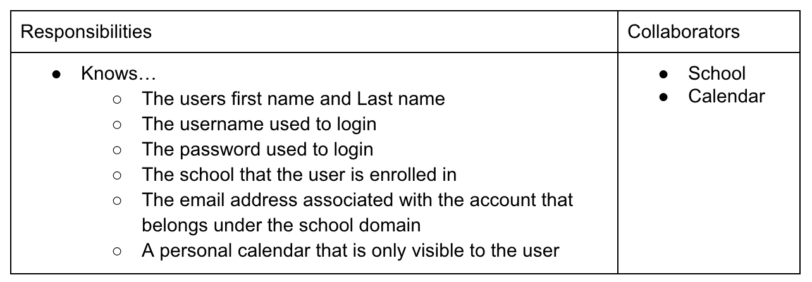
###Instructor
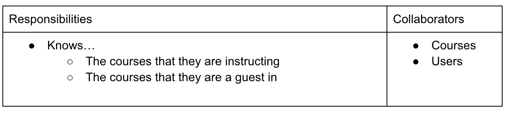
###Student
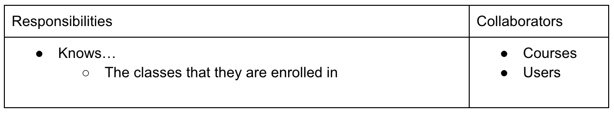
###School_Admin
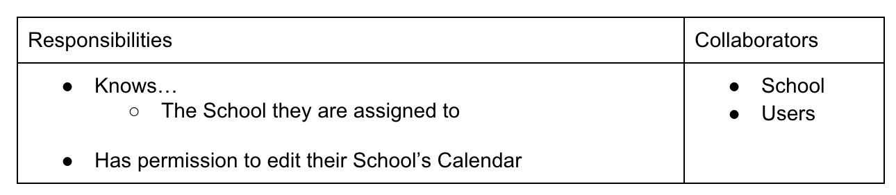
###School

###Course
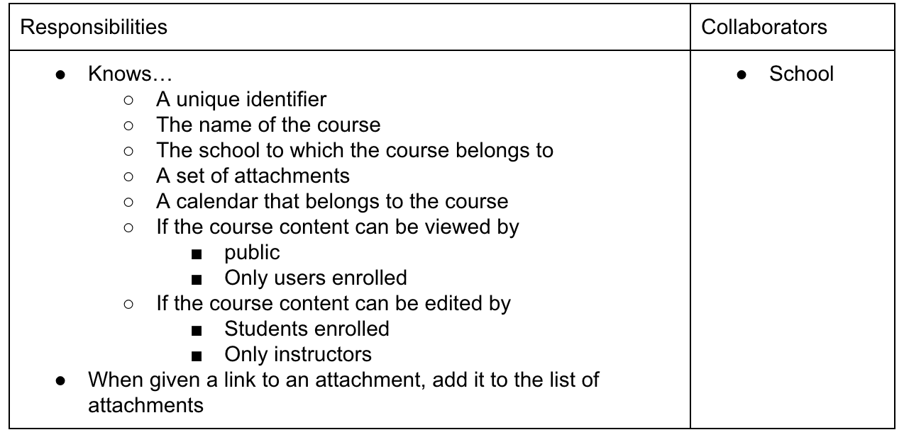
###Calendar
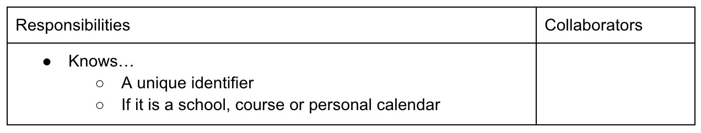
###Event
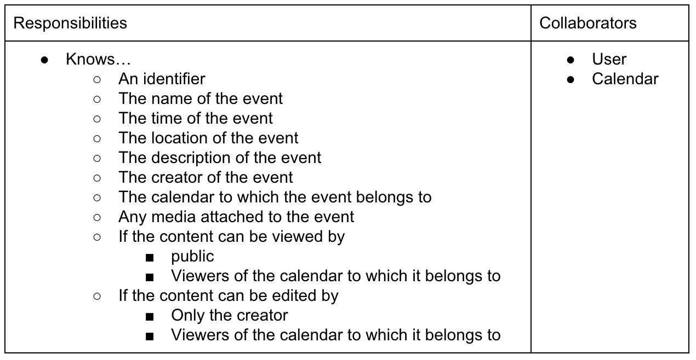
###Reminder
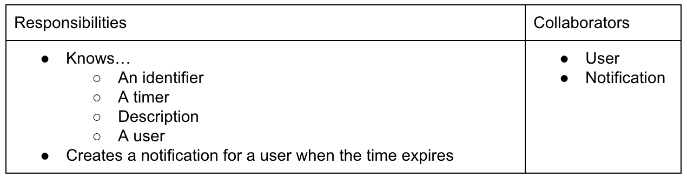
###Notification
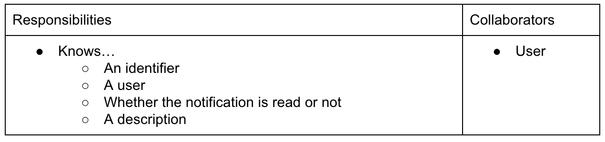
###Interface
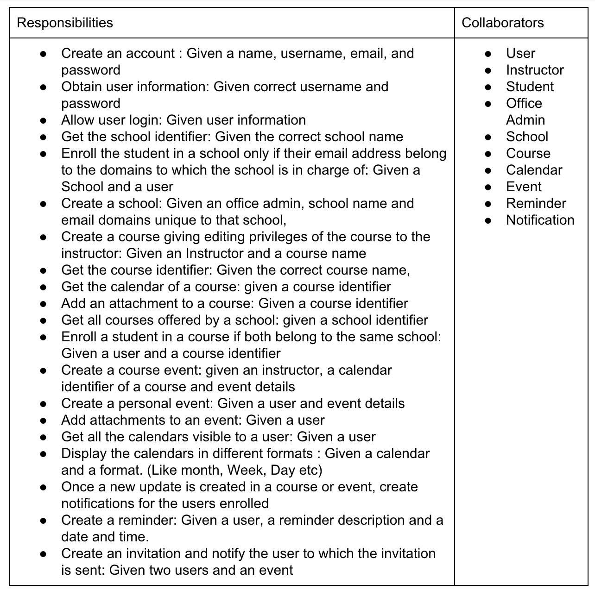

##User stories played out to our CRC cards:

*As a non registered user, I want to register*
- Create an account via the Interface

*As a registered user, I want to login so I can enrol in a school, courses and view calendars.*
- Login through the Interface with username and password
- Username and password is passed to a data access object to validate user credentials
- Data access object obtains user information
- The user now has sufficient access to enrol in a school, courses and to view calendars

*As a user, I want to enrol in a school.*
- Provide a valid school email address to the interface to enrol in a school
- Data access object obtains school information
- The School will validate the email address
- Upon validation, the student will be registered to a school 

