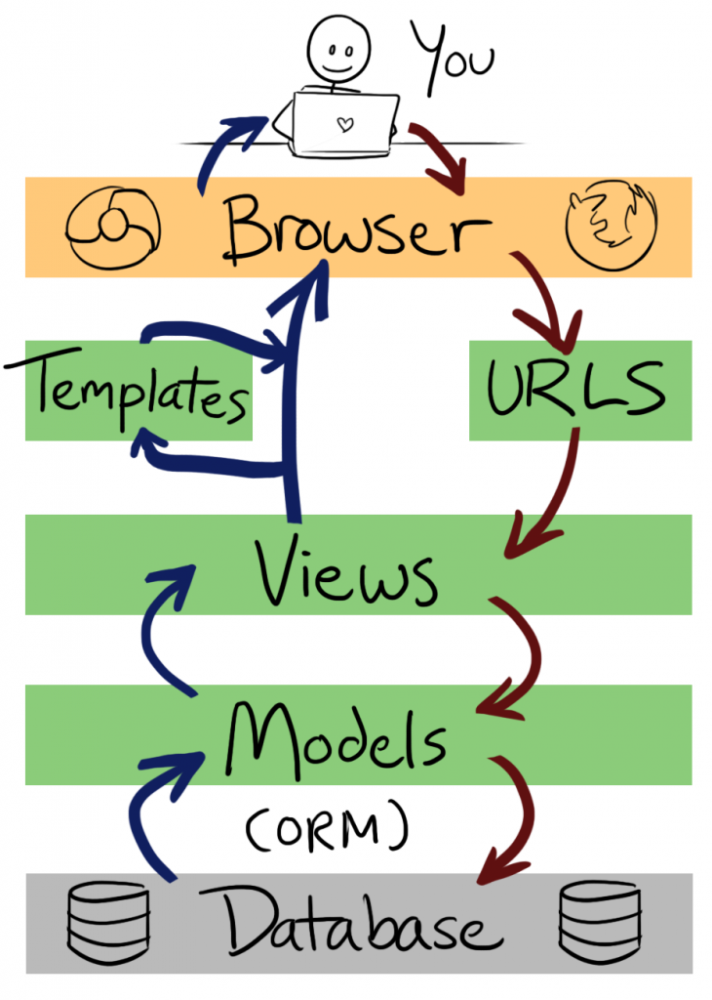

# Architecture
## Process execution structure  

(Ref: http://littlegreenriver.com/weblog/wp-content/uploads/mtv-diagram-730x1024.png)

## Module structure
Django operates using a MVT design framework; as a consequence, objects do not directly call other objects to perform a task. Instead, django’s framework acts as a “controller” by sending requests to the appropriate view, according to the Django URL configuration. Django’s “views” act as an interface between the model functions (explained in the file structure) and the template. 
Our project is separated into 4 different applications where the views are categorized according to their own functionalities:
- __Main + authentication__ handles responsibilities relating to users such as registration and login and creation of all objects owned by a user instance.
- __Scheduler__ handles event and calendar functionalities
- __Courses__ handles the creation and maintenance of school and course objects
- __Notifications__ handles different signals to create the necessary notifications. 

## File structure
### Databases
- Object Relational Mapping: Models belonging to applications whose attributes represent database fields
    - Authentication : UserProfile, Instructor, Student
    - Scheduler: Event, Calendar
    - School: SchoolProfile, CourseProfile
- Notifications: Notification
- Relations: Represent many to many relationships
    - UserProfile_Courses : The courses each user is enrolled in
    - course_student_admins : The admins of each course
- Django models: Used by Django’s built-in features such as authentication
User, user_permission

## Most significant architecture decisions:

### Choosing django framework
__Reasons:__
One (former) team member who was very experienced in Django suggested our group use the framework. Every group member had experience with Python so we thought that learning the Django framework would be relatively simple.
Our group was also driven towards using Django thanks to its object relational mapper which simplified sql queries or tables. 

__Good decision?__ Initially in the early stages of our project, our group struggled to learn the intricacies of Django, leading us to initially view it as a poor choice of framework. However, by Phase IV, most of the members were comfortable with the framework. Reflecting on the project with the benefit of hindsight, we now view the framework decision in a decisively positive light . Learning an unfamiliar framework not only pushed us to work harder, it also forced us learn a new skillset which we feel will be very useful moving forward. 

“Each mistake teaches you something new about yourself. There is no failure, remember, except in no longer trying. It is the courage to continue that counts.” ― Chris Bradford

### Dividing up the project into four smaller applications:
__Reasons__: Project components were divided up based upon semantic meaning. This lead to a much more intuitively laid out, less cluttered program. This is crucially important when multiple people are working on the same files.

Furthermore, we found dividing up the code into separate applications made the planning of the project much simpler
It also made locating issues picked up on Github much easier 

__Good decision?__ Dividing up the project into four applications proved to be an excellent idea, allowing for a very smooth coding process.